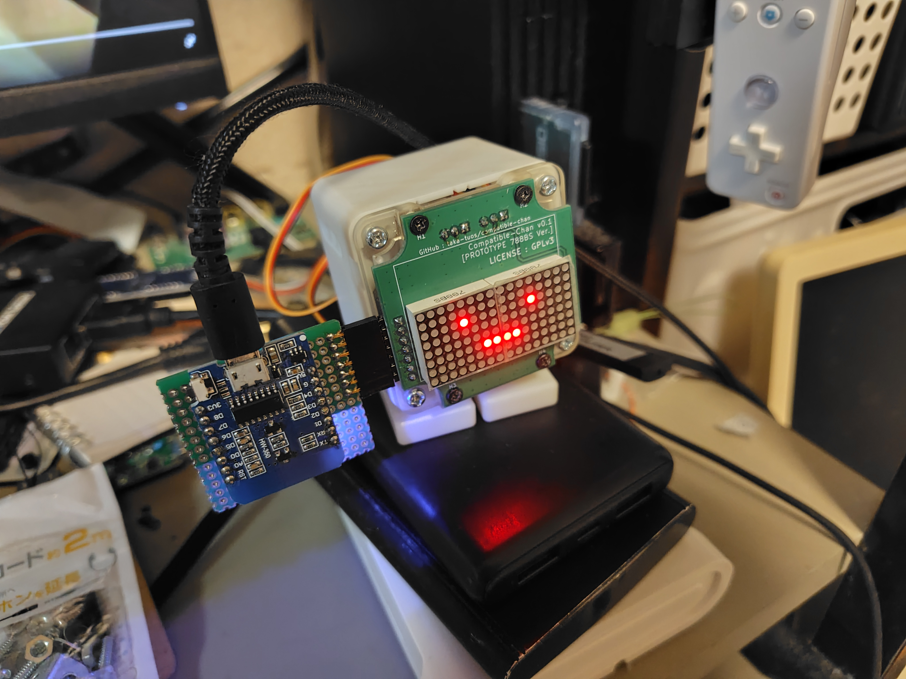

# compatible-chan
[スタックチャン](https://github.com/stack-chan/stack-chan) 用の自由なCoreモジュール (GPLv3)

# ・ _ ・

# このプロジェクトのスコープ
- スタックチャンのCoreモジュールに自由な選択肢を追加することが目的
- M5Stack系の製品を広範に置き換えるもの**ではない** (スタックチャンに必要な機能のみを実装する)

# FAQ
## Q. M5Stackって「オープンハードウェア」では？
A. 各種ピン仕様や回路図こそオープンではあるが、シェルのCADデータやガーバーファイル、BOM等が公開されていないので「自由」ではない(と自分は考えている)。

## Q. 自由でないと何がダメ？
A. スタックチャンは「サ終とともに死ぬロボットはアカン(意訳)」という思想を含んでいて[^1](https://protopedia.net/prototype/2345)、M5Stackの供給が止まると死ぬ状況はよろしくないはず。  
(実際オンラインに依存していない旧AIBOシリーズでも、部品供給が無いのでバタバタ死んでいる)  
またM5Stackの仕様に縛られる状況でその打開ができないのもよろしくない(よく挙がる例としてはスピーカーとマイクが排他なことなど)  
